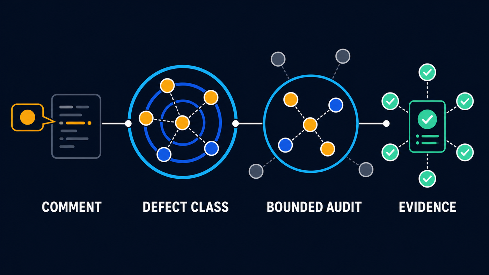

# Review Radius


**修复审查意见所揭示的同类缺陷。**

一项面向 Codex、以证据为依据的 GitHub PR 审查反馈处理技能。

Review Radius 以审查意见为起点，在明确边界内检查相关代码中是否还存在
由同一原因造成的缺陷。它先验证反馈，再提炼被破坏的不变量，检查相关代码
范围，最后依据实现状态和验证证据完成审查响应。仓库、可安装技能和调用 ID
统一为 `review-radius`。

[English](README.md) · [한국어](README.ko.md) ·
[设计](docs/design.md) ·
[实验](docs/experiments/2026-08-04-code-navigation-tool-routing.md) ·
[品牌指南](BRAND.zh-CN.md)

## 为什么选择 Review Radius

审阅者通常指出最先显现的症状。如果只修改被点名的那一行，同类缺陷可能
仍留在并列实现、别名调用方、失败路径、配置变体或测试中。



检查半径只扩展到已验证的原因和 PR 获准变更的范围。它比逐行被动修补更
完整，也比借机进行无关重构更克制。

## 工作原则

1. **把意见视为信号。** 保留审阅者观察到的事实，在确定修复边界前提炼
   被破坏的不变量。
2. **有边界地扩展。** 检查可信的相关代码，但不把一次审查变成无关的清理
   工作。
3. **用证据完成闭环。** 对候选项分类，验证不变量，并且只在实现状态足以
   支持结论时解决审查会话。

## 有边界的审查会话

Review Radius 在有边界的审查会话中运行，该会话绑定仓库、PR、当前提交头以及
会话开始时可见的反馈。后续反馈不会悄然扩大当前批次：预算尚未用尽时，同类且
阻塞性的反馈可以加入；非阻塞反馈会排队；引入新缺陷类别或重要策略决策的反馈
会暂停会话，等待用户指示。

默认自动补丁预算为 **两轮**。实现前与实现后的两次审查与这个轮数预算不同。
若修复实质上需要新的生产依赖、非平凡子系统、公共契约变更或类似策略选择，
Review Radius 会提供 build-versus-buy 选项：直接实现、使用现有依赖、引入新的
开源项目或后续处理。未经用户明确批准，不会修改生产依赖。

普通会话可选择 `Traceknot` QA 交接；对于 R2/R3 或反复审查循环，它是所需的
QA 交接。审查收敛和 QA 判定彼此独立：有边界的反馈批次收敛，不等于 QA 通过、
交付完成，也不代表 Review Radius 会自行调用。明确调用 `$review-radius` 是
启动会话最可靠的方式。

## 安装

```sh
npx skills add https://github.com/Jin-Doh/review-radius \
  --skill review-radius \
  --agent codex \
  -y
```

本地开发时，可使用当前检出目录：

```sh
npx skills add "$PWD" --skill review-radius --agent codex -y
```

处理 PR 审查反馈时，以 `$review-radius` 调用该技能。

## 导航策略

工具按问题类型选择，不会机械地全部执行：

- 用 `rg` 查找字面量和配置；
- 用 AST 查找语法结构相似的代码；
- 用 LSP 确认符号、别名、实现和调用方；
- 用最新代码图检查有边界的直接或传递关系；
- 用聚焦测试或运行时观察确认动态行为。

在合成 TypeScript 固件中，压缩路由的召回率和精确率均为 100%，令牌代理值
为 451；原始文本搜索的代理值为 1694。这只验证路由机制，并不能证明其在
大型真实仓库中的性能。

## 边界

Review Radius 不会：

- 把一条审查意见扩大为通用重构；
- 仅凭文本相似或推断出的图关系确认缺陷；
- 依据单一搜索工具宣称检查完整；
- 为了让 PR 看起来已清理完毕而关闭含糊或受阻的反馈；
- 取代仓库测试、CI 或运行时证据。

**Review Radius** 是产品名称；仓库、技能和调用 ID 均为
`review-radius`。文案与视觉规则见[简体中文品牌指南](BRAND.zh-CN.md)，
各语言的术语与写法见[名称与语言体系](docs/brand/naming-and-language.md)。

## 许可证

Review Radius 采用 [MIT License](LICENSE)。
可选基准测试调用的 Graphify `graphifyy==0.9.32` 声明采用 Apache License
2.0。其上游许可证、署名信息及集成边界见
[第三方声明](THIRD_PARTY_NOTICES.md)。

## 贡献与安全

单维护者 PR 政策见 [CONTRIBUTING.md](CONTRIBUTING.md)，私密漏洞报告方式见
[SECURITY.md](SECURITY.md)。
